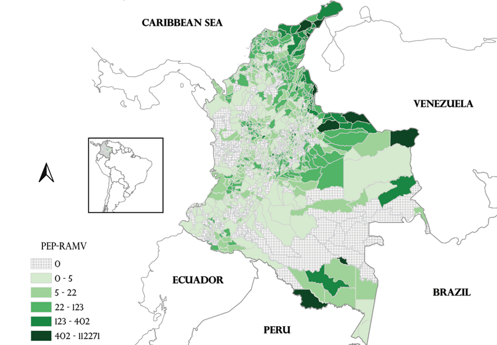
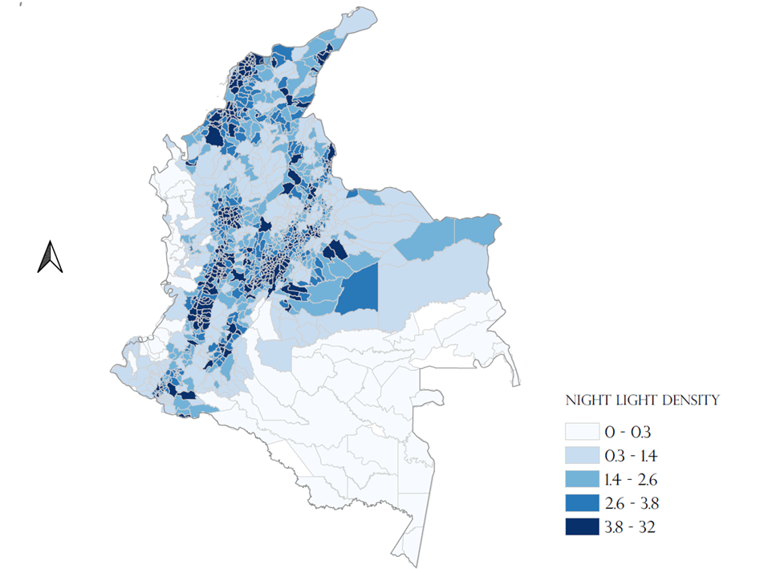
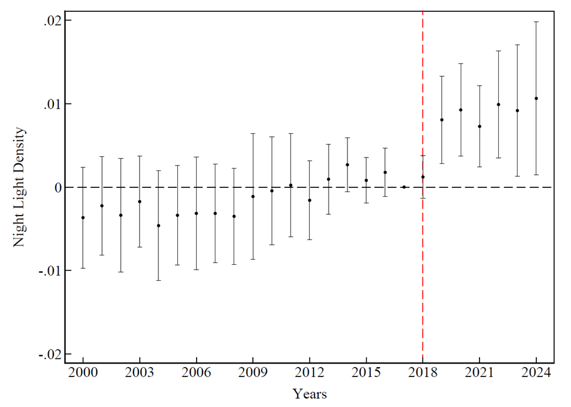

# Mass Migration Effect in Colombia

This project examines the economic effect of the large-scale Venezuelan migration wave into Colombia, leveraging non-conventional proxies of economic activity: Night Light Density (NLD), urban and cropland cover, and CO2 emissions.

---

## Data Sources and Scripts

**Urban and Cropland Cover** — `Urban_cover.py`, `Crops_cover.py`
Compute crop cover fraction from 2015 to 2019 at 100 m spatial resolution across Colombian municipalities. Data comes from COPERNICUS, which provides global land cover classifications (forests, grasslands, croplands, wetlands, etc.), processed via Google Earth Engine.

**Night Light Density** — `NLD_1992_2021.py`
Computes average night light density and its hyperbolic inverse transformation at the municipality level. Data comes from harmonized DMSP-OLS (1992–2013) and VIIRS (2013–2021) series from Li et al. (2020). The dataset was extended from 2022 to 2024 by training an ARIMAX model, with AR and MA order selected using AIC and BIC criteria. The extension is carried out to the script `ARIMA_NLD_2022_2024.R`

> Li, X., Zhou, Y., Zhao, M., and Zhao, X. (2020). A harmonized global nighttime light dataset 1992–2018. *Scientific Data*, 7(1):168.

**CO2 Emissions** — `CO2_pollution.py`
Computes CO2 emissions within municipalities using EDGAR, which provides independent emission estimates not reliant on self-reported data from member states or UNFCCC parties.

---

## Regularization Permits per inhabitant across Municipalities

---

## Night Light Density across Municipalities

---

## Event Study

A dynamic event study comparing municipalities before and after the large regularization wave of 2017, across municipalities with varying numbers of permits per inhabitant.

### Night Light Density — Event Study

